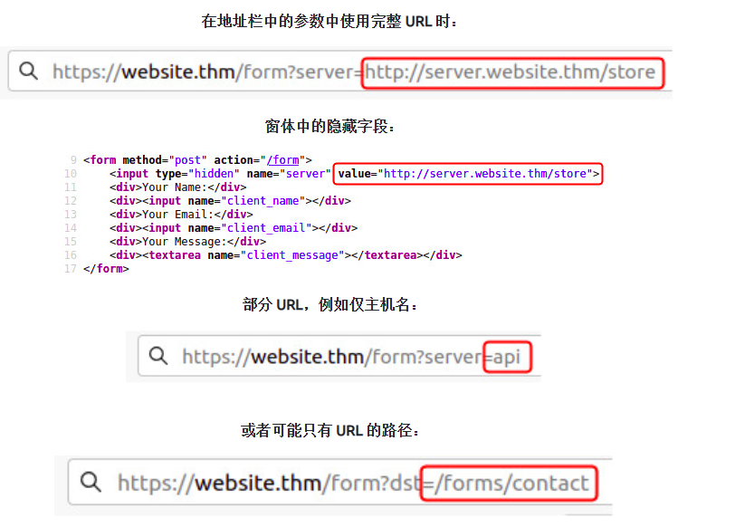

## 一、SSRF漏洞常见位置

## 二、绕过常见的SSRF防御

### 2.1拒绝名单

拒绝列表是接受除列表中指定的资源或匹配特定模式之外的所有请求的地方。Web 应用程序可以使用拒绝列表来保护敏感的终结点、IP 地址或域不被公众访问，同时仍允许访问其他位置。限制访问的特定终结点是 localhost，它可能包含服务器性能数据或其他敏感信息，因此 localhost 和 127.0.0.1 等域名将出现在拒绝列表中。**攻击者可以使用其他 localhost 引用（如 0、0.0.0.0、0000、127.1、127.*.*.*、2130706433、017700000001）或具有解析为 IP 地址 127.0.0.1 的 DNS 记录（如 127.0.0.1.nip.io）的子域来绕过拒绝列表。**

此外，在云环境中，阻止对 IP 地址 169.254.169.254 的访问将是有益的，该地址包含已部署云服务器的元数据，包括可能的敏感信息。攻击者可以通过使用指向 IP 地址 169.254.169.254 的 DNS 记录在自己的域上注册子域来绕过此漏洞。

### 2.2允许列表

允许列表是所有请求被拒绝的位置，除非它们出现在列表中或与特定模式匹配，例如参数中使用的 URL 必须以 https://website.thm 开头的规则**。** 攻**击者可以通过在攻击者的域名上创建子域（如 https://website.thm.attackers-domain.thm）来快速规避此规则。**应用程序逻辑现在将允许此输入，并允许攻击者控制内部 HTTP 请求。

### 2.3打开重定向

**如果上述绕过不起作用，攻击者还有一个技巧，即打开重定向。**开放重定向是服务器上的一个端点，网站访问者在其中自动重定向到另一个网站地址。以链接 https://website.thm/link?url=https://tryhackme.com 为例。创建此端点是为了记录访问者出于广告/营销目的点击此链接的次数。但想象一下，存在一个潜在的 SSRF 漏洞，该漏洞具有严格的规则，仅允许以 https://website.thm/ 开头的 URL。攻击者可利用上述功能将内部 HTTP 请求重定向到攻击者选择的域。

### 2.4private绕过

**/private**被限制访问，可通过**/x/../private**绕过该限制

